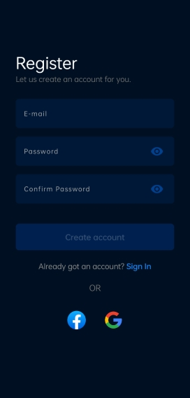
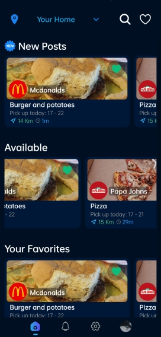
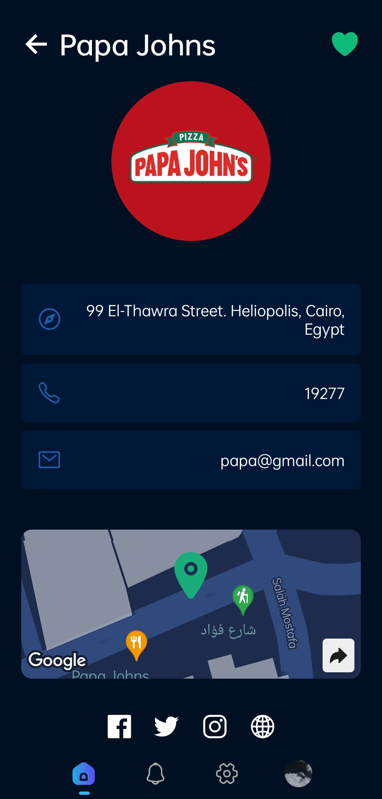
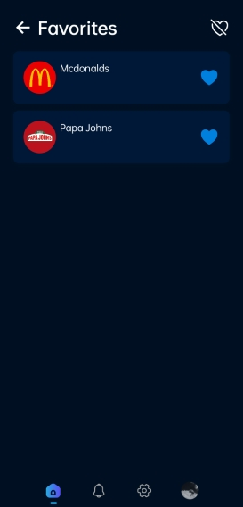

# G-Hearted

Restaurant Leftovers App is a mobile application that connects restaurants with users who are want to help stary animals with leftover food.

## Table of Content

-   [Demo](#demo)
-   [Features](#features)
-   [Built Using](#built-using)
-   [Backend](#backend)
-   [Feedback](#feedback)
-   [Author](#author)

##  Demo

Registration screen

Home screen

User Profile screen

Favorites screen

##  Features

### General Features

-   Support English and Arabic languages

-   Beautiful and Modern design using Native base

-   Switch between Dark mode and light mode

-   Sign-In & Sign-Up Pages.

-   Contains restaurant interface and user interface.

-   Only registered users can order the leftovers.

-   State management with Redux.

-   Using navigation and navigation bottom tabs using React Navigation.

-   User Data and Password are encrypted by firebase.

-   List of leftovers for users to order from.

-   Users can switch between saved location or live location to Show the nearest restaurants.

-   Has a camera screen to send a confirmation picture of the leftover order and the animal.

-   Receive Notifications is on.

 

##  Built Using:

-   React
-   React Native
-   React Navigation
-   Redux
-   Expo CLI
-   Native Base
-   Figma
-   Firebase

##  Backend

The `backend` contains firebase and including API endpoints

##  Feedback

Any questions or suggestions? Notice any bugs or glitches? Feel free to send me an [email](mailto:ebra0x0@gmail.com).

##  Author

Ibrahim Ali (2023).
